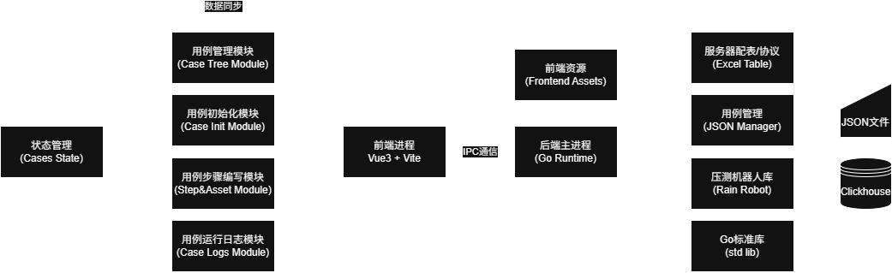

# 名将杀战斗功能自动化测试工具

控制局内武将做出出牌、弃牌等动作，同时断言服务器返回消息，实现批量运行测试用例、自动回归新版本各武将逻辑正确性。

## 功能架构图



## 技术栈

[Wails3](https://v3alpha.wails.io/) + Go 后端 + Vue3 前端 (Vite + TypeScript + [Naive UI](https://www.naiveui.com/zh-CN/dark/docs/introduction))

## 构建说明

```bash
# 开发模式
wails3 dev

# 生产构建（NSIS 安装包）
wails3 task -dir rain-qa-func windows:create:nsis:installer
```

## Android APK 下载

扫描二维码下载 Android 安装包（[`rain-qa-func.apk`](https://git.devcloud.ztgame.com/v-tangfangda/rain-qa-func/-/raw/main/rain-qa-func.apk)，GitLab main 分支 raw 链接）：

[](https://git.devcloud.ztgame.com/v-tangfangda/rain-qa-func/-/raw/main/rain-qa-func.apk)

> 链接在 APK 合并到 main 分支后生效；当前后端服务调用（wails 运行时 422）仍在修复中，UI 可正常渲染，详见 [Android APK 构建](docs/Android-APK构建.md)。

## 主要功能

- **用例管理** — 新增/复制/重命名/删除用例
- **用例初始化配置** — 牌堆、武将位置、初始状态
- **用例步骤配置** — 步骤增删改、智能描述、参数配置
- **步骤断言配置** — 断言增删改、读表匹配
- **执行控制** — 服务器地址、机器人数、并发量、飞书通知
- **日志展示** — 并行日志、级别颜色、错误统计

## 核心代码参考

| 文件 | 职责 |
|------|------|
| [case_yanwu_qa_function.go](../rain-robot/project/xcard/xcard_case/case_yanwu_qa_function.go) | 机器人 Case 逻辑 |
| [module_yanwu_qa_function.go](../rain-robot/project/xcard/xcard_case/module_yanwu_qa_function.go) | 断言模块 |
| [sem.go](../rain-robot/project/xcard/xcard_qa_function_def/sem.go) | Step/Asset 数据结构定义 |

详细架构见 [CLAUDE.md](CLAUDE.md) 和 [战斗测试流程实现](docs/战斗测试流程实现.md)。
